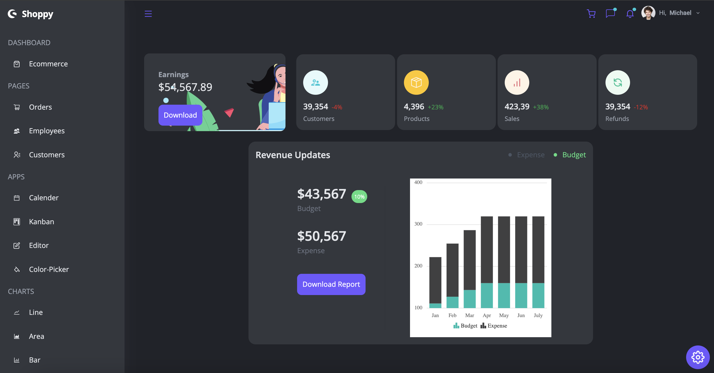

<br/>
<p align="center">
  <a href="https://github.com/mufarrah/Admin_Panel">
    
  </a>

  <h3 align="center">Admin Panel </h3>

  <p align="center">
    An E-commerce Dashboard 
    <br/>
    <br/>
    <a href="https://github.com/mufarrah/Admin_Panel/issues">Report Bug</a>
    .
    <a href="https://github.com/mufarrah/Admin_Panel/issues">Request Feature</a>
  </p>
</p>

     

## About The Project



This project is a basic structure for an administration panel for viewing a company products, services, assets, sales and revenues .

## Built With

React , Tailwind css , syncfusion

## Getting Started


### Installation


1. Clone the repo

```sh
git clone https://github.com/mufarrah/Admin_Panel.git
```

2. Install NPM packages

```sh
npm install
```

3. run the project

```JS
npm start 
```

## Contributing

Contributions are what make the open source community such an amazing place to be learn, inspire, and create. Any contributions you make are **greatly appreciated**.
* If you have suggestions for adding or removing projects, feel free to [open an issue](https://github.com/mufarrah/Admin_Panel/issues/new) to discuss it, or directly create a pull request after you edit the *README.md* file with necessary changes.
* Please make sure you check your spelling and grammar.
* Create individual PR for each suggestion.
* Please also read through the [Code Of Conduct](https://github.com/mufarrah/Admin_Panel/blob/main/CODE_OF_CONDUCT.md) before posting your first idea as well.

### Creating A Pull Request

1. Fork the Project
2. Create your Feature Branch (`git checkout -b feature/AmazingFeature`)
3. Commit your Changes (`git commit -m 'Add some AmazingFeature'`)
4. Push to the Branch (`git push origin feature/AmazingFeature`)
5. Open a Pull Request

## Authors

* **A.Rahman Mufarrah ** - *Frontend developer* - [A.Rahman Mufarrah ](https://github.com/mufarrah/Admin_Panel) - **

## Acknowledgements

Credits go to adrianhajdin for his amazing work and tutorial  

* [adrianhajdin](https://github.com/adrianhajdin/project_syncfusion_dashboard)

